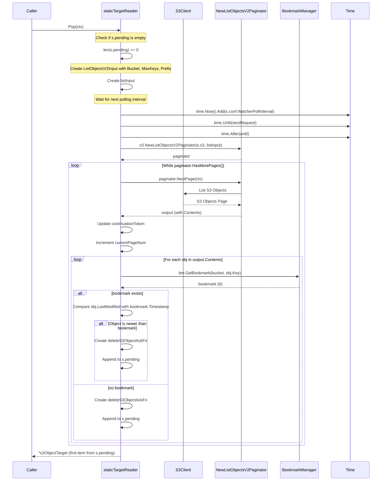
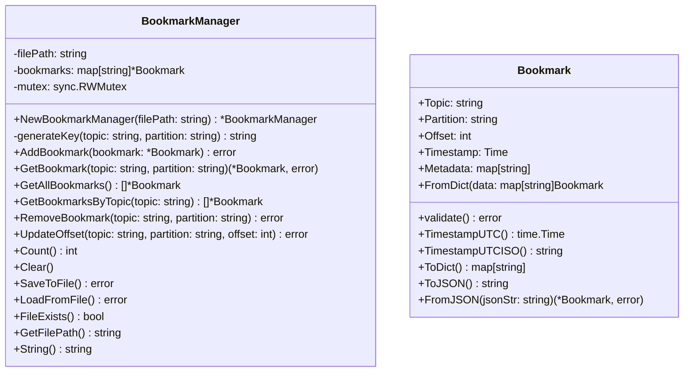

# rpanda-connect-native-plugin-example

## Introduction

The example illustrates the process of creating custom input components for Redpanda Connect using the native API.

In our Redpanda custom input example, we created a component designed explicitly for downloading AWS S3 objects. The responsibilities of the S3 monitoring component include:

- Regularly monitor the S3 bucket for new and updated objects, and download any items that have changed.

- Support bookmarking: ability to start working from a previously checkpointed bookmark

## Project setup

1. Clone the git repository

    ```bash
    git clone https://github.com/ajurcenk/rpanda-connect-native-plugin-example.git
    ```

2. Build the binaries

    ```bash
    go build
    ```

3. Update the Redpanda Connect pipeline file `./config/custom_s3_input_example.yaml`

    The pipeline regularly retrieves new objects from S3 and outputs the content of these S3 objects to stdout. The bookmarks configuration specifies the file object responsible for storing the bookmarks of processed (acknowledged) objects. 

    ```yaml
    input:
    aws_s3:
        bucket: <S3_BUCKET_NAME>
        region: <S3_REGION_NAME> 
        credentials:
        id: <AWS_ID>
        secret: <AWS_KEY>
        bookmarks_file:
        path: ./bookmarks.json
        watcher:
        poll_interval: 5s
    output:
    stdout: {}
    ```

4. Start the pipeline

    ```bash
    /rpanda-connect-native-plugin-example run ./config/custom_s3_input_example.yaml 
    ```

5. Upload files to s3 and check the pipeline output

6. Stop the pipeline

7. Check the bookmark file:  `./bookmarks.json`

## Implementation details

The custom input enhances the existing Redpanda connect source by incorporating S3 bucket change monitoring logic with bookmarking support.

### The S3 bucket changes monitoring logic

For S3 object changes, the staticTargetReader class is modified to poll the S3 object list using pagination periodically.

For each object in each page:

- Retrieves bookmark information to check if the object was previously processed

- Compares timestamps if a bookmark exists

- Creates an acknowledgment function for bookmarking

- Adds qualifying objects to the pending queue for the object read phase



### Bookmarking support

The bookmark class is utilized to monitor information related to S3 processed objects, drawing parallels with Kafka. The topic field is designated for storing the S3 bucket, while the partition field holds the object key.



The Bookmark File Manager class plays a crucial role in ensuring the persistence of bookmarks. However, it is essential to note that the bookmark manager is not equipped to handle distributed execution scenarios. This limitation arises when multiple pipelines use the same bookmark manager or when a significant volume of bookmarks is involved.

The Bookmark File Manager class handles bookmark operations

- Contains a map of bookmarks keyed by `topic:partition`

- Uses RWMutex for thread-safe concurrent access

- Provides CRUD operations and file persistence

The new S3 reader creation operation initiates an instance of the bookmark manager and loads the bookmarks data. The acknowledgment function utilizes the bookmark manager to save the processed bookmarks once the acknowledgment is confirmed.
